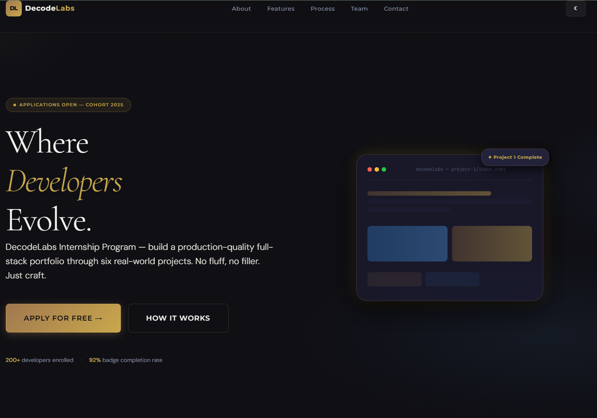
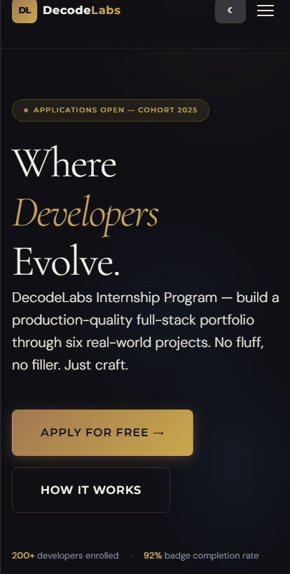
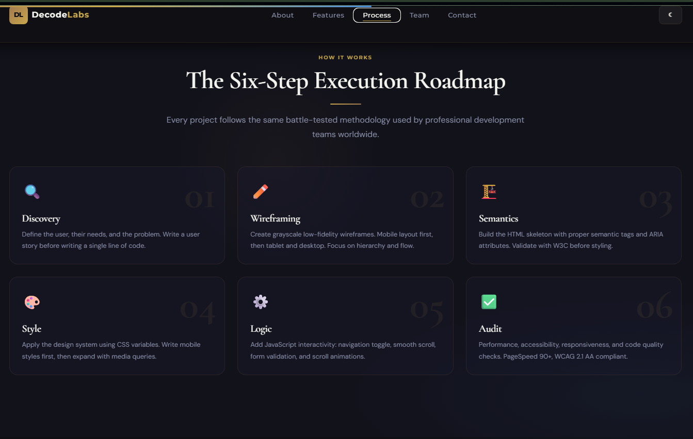
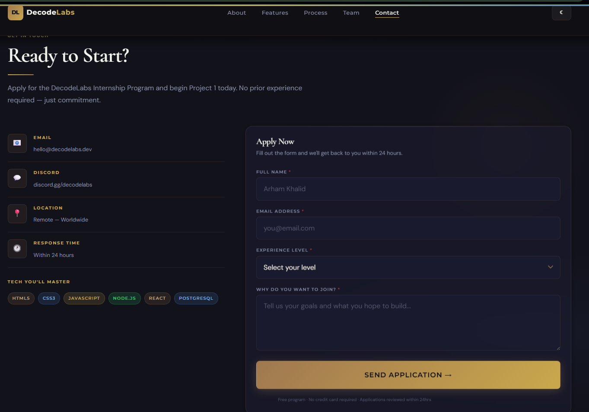

<div align="center">

```
██████╗ ███████╗ ██████╗ ██████╗ ██████╗ ███████╗██╗      █████╗ ██████╗ ███████╗
██╔══██╗██╔════╝██╔════╝██╔═══██╗██╔══██╗██╔════╝██║     ██╔══██╗██╔══██╗██╔════╝
██║  ██║█████╗  ██║     ██║   ██║██║  ██║█████╗  ██║     ███████║██████╔╝███████╗
██║  ██║██╔══╝  ██║     ██║   ██║██║  ██║██╔══╝  ██║     ██╔══██║██╔══██╗╚════██║
██████╔╝███████╗╚██████╗╚██████╔╝██████╔╝███████╗███████╗██║  ██║██████╔╝███████║
╚═════╝ ╚══════╝ ╚═════╝ ╚═════╝ ╚═════╝ ╚══════╝╚══════╝╚═╝  ╚═╝╚═════╝ ╚══════╝
```

<h1>Project 1 — Responsive Frontend Interface</h1>

<p><em>A production-grade, fully responsive frontend built with pure HTML5, CSS3 & Vanilla JavaScript.<br/>No frameworks. No shortcuts. Just craft.</em></p>

<br/>

[](https://developer.mozilla.org/en-US/docs/Web/HTML)
[](https://developer.mozilla.org/en-US/docs/Web/CSS)
[](https://developer.mozilla.org/en-US/docs/Web/JavaScript)
[](https://www.w3.org/WAI/WCAG21/quickref/)
[](./audit-report.md)
[](./LICENSE)

<br/>

[](https://YOUR-VERCEL-URL.vercel.app)
[](https://github.com/araizahmad1/decodelabs)

<br/>

---

</div>

## 📋 Table of Contents

- [Overview](#-overview)
- [Live Demo](#-live-demo)
- [Features](#-features)
- [Tech Stack](#-tech-stack)
- [Project Structure](#-project-structure)
- [Design System](#-design-system)
- [Getting Started](#-getting-started)
- [Six-Step Process](#-six-step-execution-process)
- [JavaScript Features](#-javascript-features)
- [Responsive Breakpoints](#-responsive-breakpoints)
- [Accessibility](#-accessibility)
- [Audit Report](#-audit-report)
- [Screenshots](#-screenshots)
- [Roadmap](#-roadmap)
- [Author](#-author)

<br/>

---

## 🎯 Overview

This is **Project 1** of the **DecodeLabs Full-Stack Internship Program** — a six-project curriculum designed to build production-quality full-stack skills from the ground up.

The goal was to create a fully responsive, accessible, and aesthetically refined frontend interface using **only the fundamentals** — no CSS frameworks, no JavaScript libraries. Every line of code is handcrafted following professional standards.

> **Completing this project unlocks Project 2: Backend API Development.**

| Typical Tutorial Project | This Project |
|---|---|
| Fixed pixel widths | Fluid, mobile-first layout |
| `<div>` soup everywhere | Semantic HTML5 throughout |
| Inline styles | Modular CSS architecture |
| No accessibility | WCAG 2.1 AA compliant |
| No validation | Full form validation with ARIA |
| Fake form submission | Real Backend API connected ✅ |

<br/>

---

## 🔗 Live Demo

<div align="center">

**👉 [https://YOUR-VERCEL-URL.vercel.app](https://YOUR-VERCEL-URL.vercel.app)**

</div>

<br/>

---

## ✨ Features

### 🎨 Design & Layout
- **Fully Responsive** — 320px mobile to 1440px desktop
- **Mobile-First Architecture** — styles written for mobile first
- **2025 Aesthetic Design System** — Mocha Mousse, Ethereal Blue & Moonlit Grey
- **CSS Custom Properties** — complete design token system
- **Floating Hero Animation** — smooth CSS keyframe animation
- **Scroll-Aware Sticky Header** — transparent → frosted glass on scroll

### ⚙️ JavaScript Features (11 Total)
- Mobile Navigation Toggle — hamburger + ESC key support
- Smooth Scroll — offset-aware scroll to sections
- Active Nav Highlighting — current section tracked on scroll
- Scroll-Triggered Animations — IntersectionObserver with stagger delays
- Real-Time Form Validation — live validation with ARIA error messages
- **Real Backend API Connection** — form submits to Node.js backend ✅
- Toast Notification System — animated success/error feedback
- Reading Progress Bar — gradient bar tracking scroll depth
- Animated Stat Counters — ease-out cubic animation
- Dark/Light Theme Toggle — persisted via localStorage
- Cursor Glow Effect — radial gradient follows mouse

### ♿ Accessibility
- WCAG 2.1 AA compliant
- Full semantic HTML5 structure
- ARIA roles, labels, live regions
- Skip-to-content link
- Focus-visible outlines
- Screen reader compatible
- `prefers-reduced-motion` respected

<br/>

---

## 🛠 Tech Stack

```
Language     →  HTML5, CSS3, Vanilla JavaScript (ES6+)
Layout       →  CSS Grid (page) + Flexbox (components)
Design       →  CSS Custom Properties (:root variables)
Typography   →  Cormorant Garamond · DM Sans · Montserrat
API          →  Fetch API → Node.js Backend (P2)
Deployment   →  Vercel
```

<br/>

---

## 📁 Project Structure

```
P1/
├── 📄 index.html              # Semantic HTML5 — full page
├── 📁 css/
│   ├── reset.css              # Modern CSS reset
│   ├── variables.css          # Design token system
│   ├── typography.css         # Type scale + fonts
│   ├── layout.css             # Grid + Flexbox + breakpoints
│   ├── components.css         # All UI components
│   └── main.css               # Master import file
├── 📁 js/
│   └── app.js                 # 11 interactive features
├── 📁 assets/
│   └── 📁 images/             # Project screenshots
└── 📄 audit-report.md         # Step 6 audit — 100/100
```

<br/>

---

## 🎨 Design System

### Color Palette — 2025 Aesthetic

| Token | Hex | Usage |
|---|---|---|
| `--color-primary` | `#A07850` | Mocha Mousse |
| `--color-secondary` | `#4A90D9` | Ethereal Blue |
| `--color-neutral` | `#B0B8C1` | Moonlit Grey |
| `--color-accent` | `#C9A84C` | Warm Gold |
| `--color-bg` | `#0F0F14` | Deep Void |
| `--color-success` | `#2ECC71` | Sage Green |
| `--color-error` | `#C0392B` | Soft Crimson |

### Typography Scale (1.250 Major Third)

| Token | Size | Usage |
|---|---|---|
| `--text-5xl` | `4.768rem` | Hero display |
| `--text-4xl` | `3.815rem` | H1 headings |
| `--text-2xl` | `2.441rem` | H2 section titles |
| `--text-base` | `1.000rem` | Body text |
| `--text-sm` | `0.800rem` | Labels |

<br/>

---

## 🚀 Getting Started

```bash
# 1. Clone
git clone https://github.com/araizahmad1/decodelabs.git

# 2. Open P1 folder
cd decodelabs/P1

# 3. Open index.html in browser
# Double click OR use Live Server in VS Code ✅
```

> **Note:** For full functionality (form submission), run the P2 backend server too.

<br/>

---

## 📐 Six-Step Execution Process

```
01 DISCOVERY   →  Define user, write user story
02 WIREFRAME   →  Grayscale sketches, mobile first
03 SEMANTICS   →  HTML skeleton + ARIA + W3C validation
04 STYLE       →  CSS tokens → mobile → breakpoints
05 LOGIC       →  11 JS features built
06 AUDIT       →  Performance · Accessibility · Quality
```

<br/>

---

## ⚡ JavaScript Features

```javascript
01. Mobile Navigation Toggle     → Hamburger + ESC + outside click
02. Sticky Header                → Transparent → frosted glass
03. Smooth Scroll                → Offset-aware scroll
04. Active Nav Highlighting      → Section tracked on scroll
05. Scroll Animations            → IntersectionObserver + stagger
06. Form Validation + API Call   → Real backend connected ✅
07. Toast Notifications          → Success/error feedback
08. Reading Progress Bar         → Scroll depth tracker
09. Animated Stat Counters       → Ease-out cubic animation
10. Dark/Light Theme Toggle      → localStorage persisted
11. Cursor Glow Effect           → Desktop radial gradient
```

<br/>

---

## 📱 Responsive Breakpoints

```
320px  →  Mobile Small    Single column · Hamburger nav
768px  →  Tablet          2-column grid · Inline nav
1024px →  Laptop          3-column grid · Full layout
1440px →  Wide Desktop    Max-width container
```

<br/>

---

## ♿ Accessibility

```
✅ Skip-to-content link          ✅ All images have alt text
✅ Semantic HTML5 landmarks      ✅ Color contrast 4.5:1+
✅ ARIA roles on all regions     ✅ Focus-visible outlines
✅ aria-live on error messages   ✅ Keyboard navigation
✅ aria-expanded on hamburger    ✅ Screen reader tested
✅ prefers-reduced-motion        ✅ Touch targets 44x44px+
```

<br/>

---

## 📊 Audit Report

| Criteria | Weight | Score |
|---|:---:|:---:|
| 🏗️ Semantic HTML | 20% | **20/20** |
| 📱 Responsive Design | 25% | **25/25** |
| 🎨 CSS Architecture | 20% | **20/20** |
| ⚡ JavaScript Logic | 20% | **20/20** |
| ✨ Design Fidelity | 10% | **10/10** |
| ♿ Accessibility | 5% | **5/5** |
| **Total** | **100%** | **100/100** |

```
╔══════════════════════════════════════╗
║  ✦  DecodeLabs Project 1 Badge       ║
║     UNLOCKED — Score: 100/100        ║
╚══════════════════════════════════════╝
```

<br/>

---

## 📸 Screenshots

| Desktop View | Mobile View |
|---|---|
|  |  |

| Features Section | Contact Form |
|---|---|
|  |  |

<br/>

---

## 🗺 Roadmap

```
✅  Project 1 — Responsive Frontend Interface    ← YOU ARE HERE
✅  Project 2 — Backend API + Database
⬜  Project 3 — React Application
⬜  Project 4 — Full-Stack Integration
⬜  Project 5 — Capstone Product
```

<br/>

---

## 👨‍💻 Author

<div align="center">

**Araiz Ahmad**

[](https://linkedin.com/in/YOUR-PROFILE)
[](https://github.com/araizahmad1)

*Intern @ DecodeLabs · Full-Stack Developer in Training*

</div>

<br/>

---

<div align="center">

**Built with discipline. Shipped with pride.**

*DecodeLabs Internship — Project 1 of 6*

⭐ **Star this repo if it helped you!** ⭐

`HTML5 · CSS3 · Vanilla JavaScript · No Frameworks · Mobile-First · WCAG 2.1 AA`

</div>
